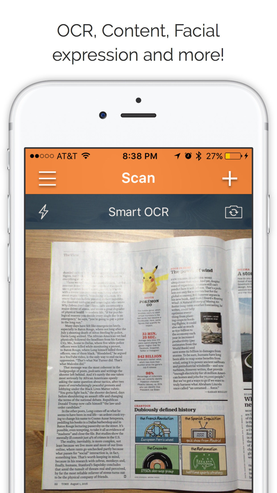
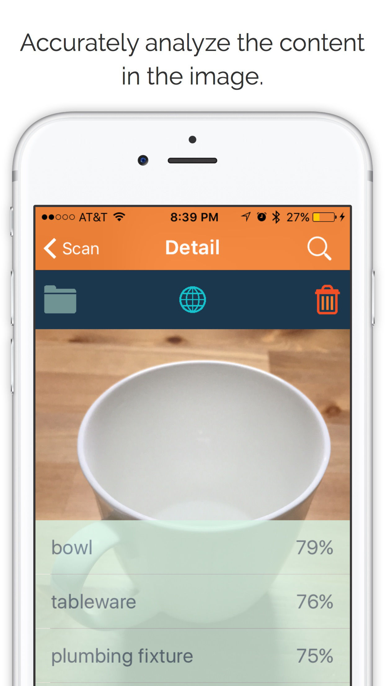
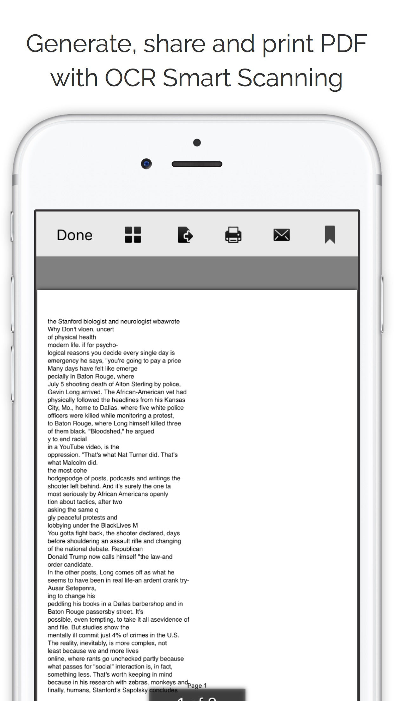

# Visionary

Visionary intergrates the powerful Google Cloud Vision API into a simple iOS app. The app scans an image gives you feedbacks about the content. The app also support OCR and QR scanning. 

## About Google Cloud Vision
"Google Cloud Vision API enables developers to understand the content of an image by encapsulating powerful machine learning models in an easy to use REST API. It quickly classifies images into thousands of categories (e.g., "sailboat", "lion", "Eiffel Tower"), detects individual objects and faces within images, and finds and reads printed words contained within images. You can build metadata on your image catalog, moderate offensive content, or enable new marketing scenarios through image sentiment analysis. Analyze images uploaded in the request or integrate with your image storage on Google Cloud Storage." (From developers.google.com) [More informatin](https://cloud.google.com/vision/?utm_source=google&utm_medium=cpc&utm_campaign=2015-q1-cloud-na-gcp-skws-freetrial-en&gclid=Cj0KEQjw7Ne_BRDRmP2ojKfzv98BEiQAPuqPyePwdFoOWXJ4s8QhAx6Fezjb3-QnEBzFk0vrkm7GgzcaAjVl8P8HAQ)

## Details about Visionary:

Imagine if you can convert a full page of text to the digital format with one click. Imagine if you can open the Wikipedia page of a famous brand by scanning its logo. Imagine if an app can detect emotions percentage of the people in your photos. 
Those aren't imaginations anymore. Visionary is the ultimate smart image analyzer app that you have always been dreaming about. Simply choose the category, take or pick an image, the app will analyze the content of the image for you. From emotion percentage of your friend to the name of a famous landmark, Visionary uses the powerful Google Cloud Vision to quickly and efficiently help you understand the world around you better. What are you waiting for? [Download](https://itunes.apple.com/us/app/visionary-image-content-analysis/id1092668816?mt=8) the visionary app today!

Label Detection:
The most basic function. It gives you keywords about your image.

Face/Emotion Detection:
It detects the number of people and overall emotions in your image.

### NOTE:
Visionary and Google Cloud Vision are developing technologies. Please understand that the result delivered will be inaccurate. 

If you have any questions about the implementation please let me know. If you want to run ConvNet on iOS, such as InceptionV3 to accomplish these tasks locally, please refer to my other code. 

Credit:
Developer: Neil Nie

Special Thanks to Google Developers/Google Cloud Platform